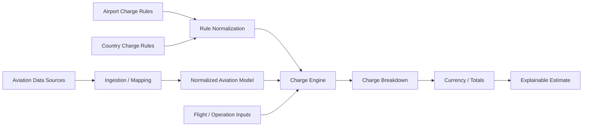
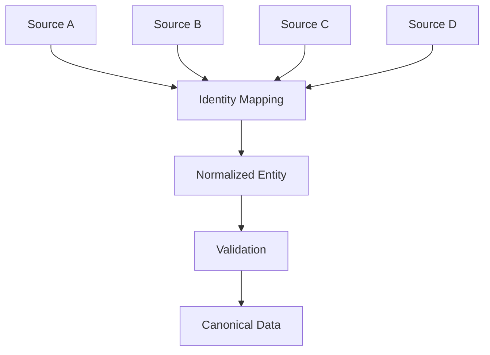
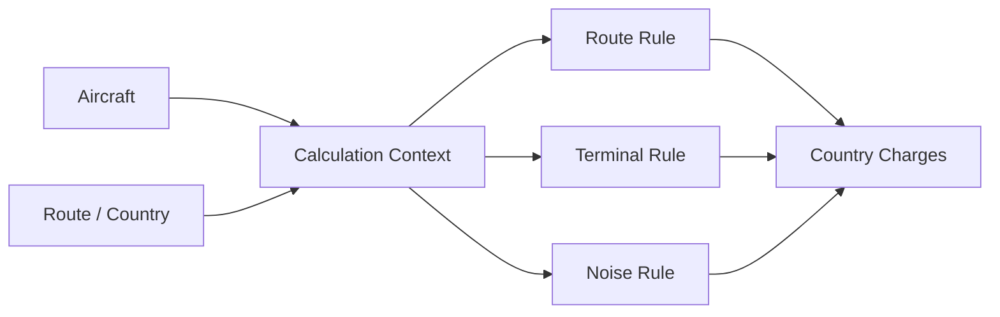
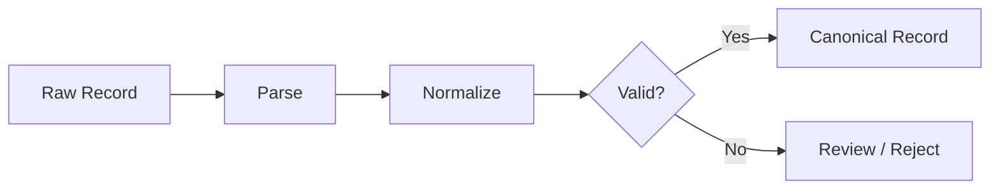

# JarisAI Engineering

> Engineering case study of an aviation cost-intelligence platform for calculating airport, navigation, passenger, handling, and operational charges.

**Live product:** [jarisai.com](https://jarisai.com/)

Aviation cost calculation looks simple until the inputs come from different authorities, currencies, aircraft classifications, airport rules, country rules, and charging formulas.

JarisAI was built to turn that fragmented information into a structured calculation system. I worked on the engineering of the platform, including consolidating airport and aircraft information from multiple sources, modeling heterogeneous charging rules, and producing explainable cost calculations.

This repository documents the architecture and engineering ideas behind the system without publishing proprietary production code, licensed datasets, or confidential business logic.

---

## The problem

Estimating the cost of an aircraft movement can require combining many independent charges.

Depending on the airport, country, aircraft, route, and operation, a calculation may include:

- landing charges
- parking charges
- passenger facility charges
- security charges
- PRM charges
- baggage-related charges
- runway charges
- air traffic service charges
- ground power / GPO-related charges
- route/navigation charges
- terminal charges
- noise-related charges

The difficulty is not merely adding numbers.

Each charge may use a different basis:

```text
aircraft weight
passenger count
time parked
airport
country
terminal
flight type
route
noise category
aircraft class
fixed fee
tiered fee
minimum charge
currency
```

A useful system therefore needs a **rules engine and normalized aviation data model**, not a spreadsheet with a large collection of constants.

## System overview



The central design principle is to separate:

1. **reference data**
2. **charging rules**
3. **calculation context**
4. **calculation execution**
5. **result presentation**

This makes it possible to add or update rules without turning the application into a long chain of airport-specific conditionals.

## Data normalization

The underlying aviation data was assembled from multiple platforms and datasets rather than one perfectly consistent source.

Typical entities include:

```ts
type Airport = {
  icao: string;
  iata?: string;
  name: string;
  country: string;
  coordinates: {
    latitude: number;
    longitude: number;
  };
};

type Aircraft = {
  typeCode: string;
  manufacturer?: string;
  model?: string;
  mtow?: number;
  category?: string;
};
```

The real challenge is entity reconciliation.

One source may identify an airport by ICAO code, another by IATA code, and another by an internal identifier. Aircraft naming is similarly inconsistent.

The ingestion layer therefore has to map source-specific records onto stable internal identities.



## Charge taxonomy

Instead of treating every fee as an unrelated field, JarisAI models charges by their operational meaning.

### Airport-level charges

Examples include:

- landing
- parking
- passenger facility / PFC
- security
- PRM
- baggage
- runway / infrastructure
- ATS
- ground power / GPO

### Country-level charges

Examples include:

- route/navigation
- terminal
- noise-related charges

The exact applicability and formula depend on the relevant authority and operation.

## Rule model

A charge rule can be thought of as a combination of:

```text
Applicability
    +
Calculation basis
    +
Rate / tiers
    +
Constraints
    +
Currency
    +
Source metadata
```

For example, a simplified weight-based rule might resemble:

```json
{
  "charge": "landing",
  "basis": "mtow",
  "unit": "1000kg",
  "rate": 8.25,
  "minimum": 120,
  "currency": "EUR"
}
```

A tiered rule is more complicated:

```text
0–20 tonnes       → rate A
20–50 tonnes      → rate B
50+ tonnes        → rate C
minimum charge    → M
```

The production system can support richer conditions, but the important architectural point is that **rules are represented as data wherever practical**.

## Calculation engine

The engine receives a calculation context containing the information required by relevant rules.

```ts
type CalculationContext = {
  airport: Airport;
  aircraft: Aircraft;
  passengers?: number;
  parkingDuration?: number;
  operationType?: string;
  route?: RouteContext;
};
```

The conceptual execution flow is:

```python
context = build_context(request)

rules = find_applicable_rules(context)

results = []

for rule in rules:
    if rule.applies(context):
        amount = rule.calculate(context)
        results.append(
            explain(rule, amount, context)
        )

return aggregate(results)
```

This is intentionally different from:

```python
if airport == "X":
    ...
elif airport == "Y":
    ...
```

because that approach becomes increasingly difficult to test, audit, and update as coverage expands.

## Example: landing charge

A simplified landing calculation might use maximum takeoff weight.

```text
MTOW
  ↓
convert to charging unit
  ↓
identify applicable tier(s)
  ↓
apply rate
  ↓
apply minimum / maximum rules
  ↓
landing charge
```

Different airports may use different weight units, rounding rules, tiers, minimums, or aircraft categories, so the engine must preserve those differences without losing a common calculation interface.

## Example: parking

Parking demonstrates why a generic calculator is difficult.

A rule can depend on:

- aircraft weight
- free parking period
- number of hours or 24-hour periods
- stand category
- time rounding
- minimum amount

Conceptually:

```python
billable_time = max(0, parked_time - free_period)
units = charging_round(billable_time)
amount = units * parking_rate
```

The actual rate may itself depend on aircraft properties.

## Route and terminal charges

Not every cost belongs to an airport.

Country or air-navigation charges can depend on route characteristics and aircraft parameters.



Keeping country rules separate from airport rules prevents the airport entity from becoming responsible for charges governed at another level.

## Explainability

For a cost-intelligence system, returning only a total is not enough.

A result should be traceable to its components.

```text
Estimated total
├── Landing
├── Parking
├── Security
├── Passenger / PFC
├── PRM
├── Terminal
└── Route / navigation
```

Each component can carry calculation metadata such as:

- basis used
- quantity
- rate
- minimum applied
- currency
- source/rule reference

That structure makes the result easier to verify and debug when an underlying tariff changes.

## Currency handling

A multi-country cost engine inevitably encounters multiple currencies.

A robust design distinguishes between:

```text
native charge amount
        ↓
native currency
        ↓
conversion layer
        ↓
requested display currency
```

The original value should not disappear simply because the UI displays a converted total.

This helps preserve traceability and avoids mixing tariff logic with exchange-rate logic.

## Validation & data quality

Real-world datasets frequently disagree.

Potential issues include:

- missing MTOW values
- different airport identifiers
- duplicate aircraft models
- inconsistent units
- outdated tariffs
- incomplete applicability conditions
- conflicting values between sources

The system therefore benefits from explicit validation rather than assuming ingestion succeeded because a record parsed.



## Technology & engineering areas

| Area | Focus |
| --- | --- |
| Application | Full-stack web product |
| Data | aviation, airport and aircraft datasets |
| Integration | multiple external data sources |
| Domain modeling | airports, aircraft, countries, routes |
| Rules | configurable charging formulas |
| Calculations | weight, passengers, duration, route and operational inputs |
| Reliability | validation, normalization, traceability |
| Product | searchable cost breakdowns and estimates |

## Engineering challenges

### Heterogeneous tariffs

There is no universal airport charging formula. The architecture has to support variation without becoming a collection of one-off implementations.

### Inconsistent source data

Combining several aviation sources means identity resolution and normalization are first-class engineering problems.

### Rule evolution

Tariffs change. A maintainable platform needs to distinguish changing business data from stable application behavior.

### Calculation auditability

When an estimate looks wrong, engineers need to identify which rule produced it and with which inputs. Structured calculation results make that possible.

### Domain complexity

Airport, country, aircraft, passenger, route, and time-dependent rules intersect. Clear domain boundaries keep that complexity manageable.

## What I worked on

My work on JarisAI included engineering around:

- airport and aircraft data aggregation
- integrating information from multiple aviation platforms
- normalization of heterogeneous datasets
- airport-use charge modeling
- country-level charge modeling
- calculation architecture
- landing and parking cost logic
- passenger, security, PRM and baggage-related fees
- route, terminal and noise charge structures
- traceable cost breakdowns
- full-stack product integration

## Why this repository exists

The production JarisAI codebase and underlying commercial data are not published here.

This repository documents the engineering approach behind the platform using generalized examples and simplified models. It intentionally excludes proprietary algorithms, licensed datasets, credentials, customer information, and implementation details that should remain private.

---

For the product itself, visit **[jarisai.com](https://jarisai.com/)**.
