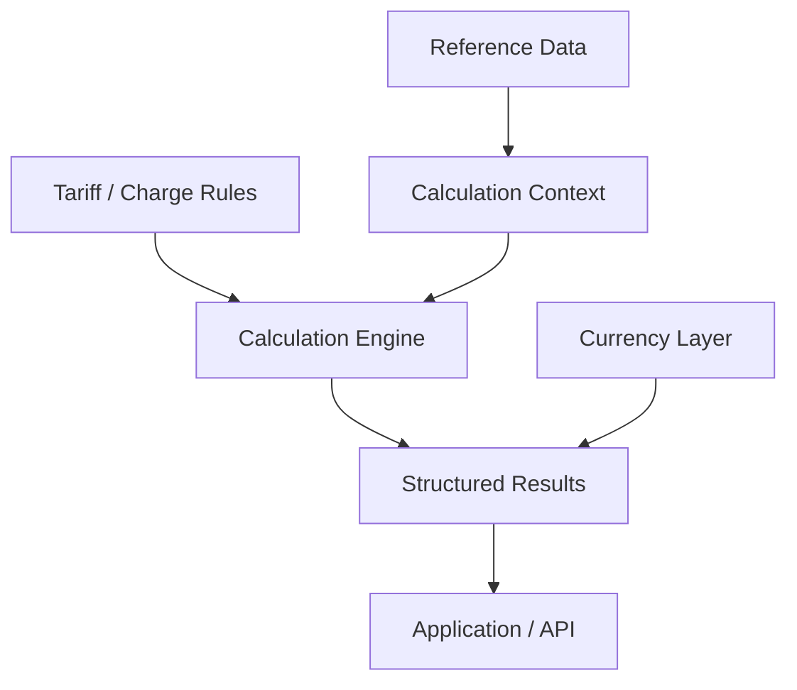

# Architecture Notes

## Domain boundaries

JarisAI becomes easier to reason about when the system is separated into explicit domains.



### Reference data

Relatively stable aviation entities:

- airports
- aircraft
- countries
- identifiers
- aircraft properties

### Rules

Time-sensitive commercial/regulatory data:

- rates
- tiers
- minimums
- applicability
- units
- charging bases

### Calculation context

Operation-specific values:

- selected airport
- aircraft
- passengers
- parking duration
- route/country context
- other applicable operational parameters

### Results

Derived values with enough metadata to explain how each amount was produced.

## Why rules should not be UI logic

A tariff embedded directly into a frontend component creates several problems:

- updates require application changes
- formulas become hard to test independently
- the same logic can be duplicated
- historical calculations become difficult to reason about

A rules-oriented design makes the charging model a domain capability rather than presentation behavior.

## Versioning

Tariffs change over time.

A mature rules system should be capable of associating rules with validity periods:

```text
effective_from
effective_to
source
revision
```

That makes it possible to distinguish "the current tariff" from "the tariff that applied when this estimate was generated."

## Testing strategy

A calculation engine benefits from table-driven tests.

```text
input context
+ rule
+ expected amount
+ expected explanation
```

Important boundaries include:

- exact tier transitions
- rounding thresholds
- minimum-charge activation
- free parking expiry
- zero passengers
- missing optional inputs
- unit conversion boundaries
